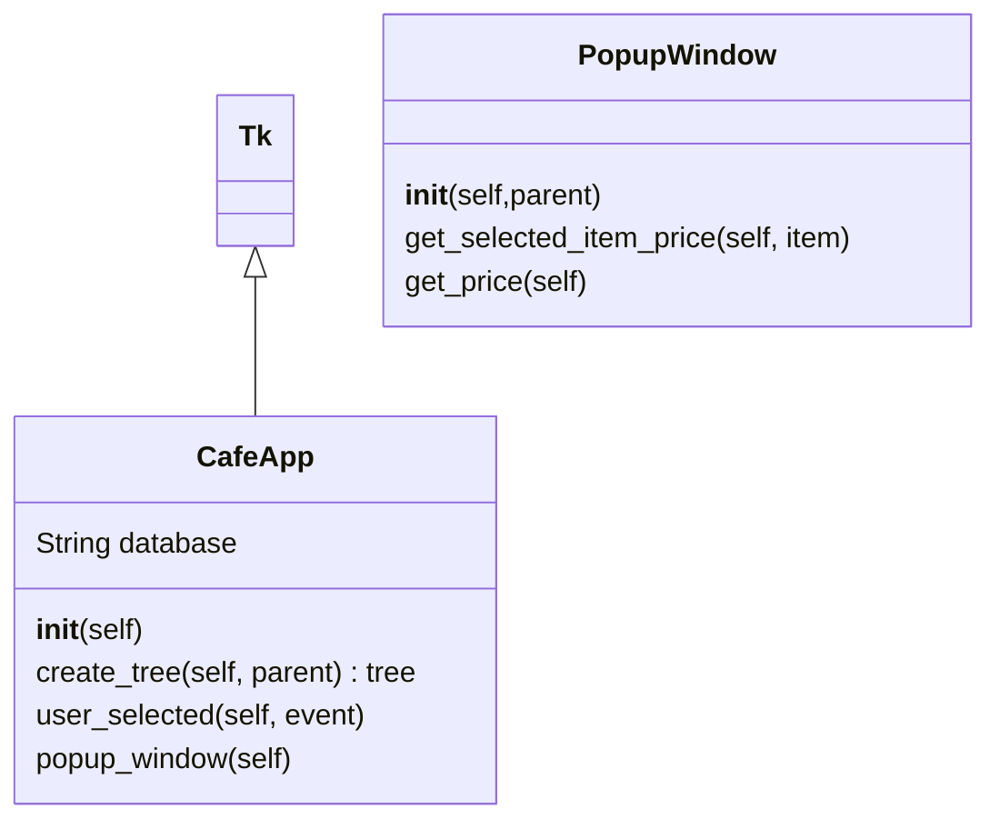

# kitty
A GUI app in python to manage the kitty for coffee with a Raspberry Pi.

# Table of Contents
1. [Flow Chart](#flow-chart)
2. [Class Diagram](#class-diagram)
3. [Third Example](#third-example)

## Flow Chart

## Class Diagram

