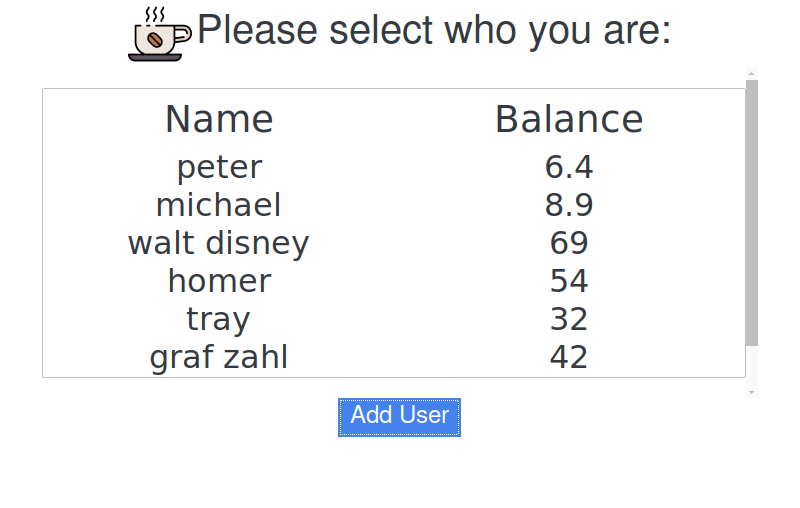
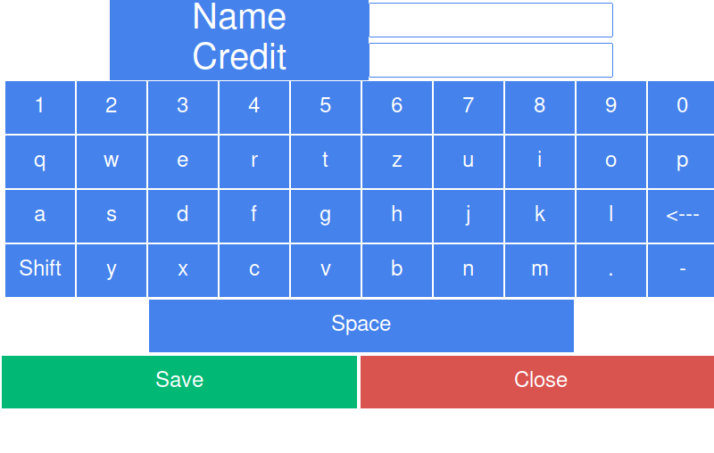

# CoffeeBox

A GUI app in python to manage the cash for coffee with a Raspberry Pi.

- [1. Annotations](#1-annotations)
- [2. Pictures](#2-pictures)
- [3. Install Python 3.9](#3-install-python-39)
- [4. Hide cursor in Raspbian](#4-hide-cursor-in-raspbian)
- [Download on your raspberry pi](#download-on-your-raspberry-pi)
- [Automatically start the python app script on startup](#automatically-start-the-python-app-script-on-startup)

## 1. Annotations

- Readme under construction
- Raspberry pi 2b model was used
- Python 3.9 was used for the program
- Ensure installation of tk bootstrap for extended gui visuals

## 2. Pictures






## 3. Install Python 3.9

To install Python 3.9 on a Raspberry Pi running the Raspberry Pi OS, follow these steps:

1. Open the terminal on your Raspberry Pi.
2. Update the package list and upgrade the system packages by running the following commands:

    ```bash
    sudo apt-get update
    sudo apt-get upgrade
    ```

3. Install the prerequisites needed to build Python from source:

    ```bash
    sudo apt-get install build-essential tk-dev libncurses5-dev libncursesw5-dev libreadline6-dev libdb5.3-dev libgdbm-dev libsqlite3-dev libssl-dev libbz2-dev libexpat1-dev liblzma-dev zlib1g-dev libffi-dev
    ```

4. Download the latest version of Python 3.9 from the official website using the following command:

    ```bash
    wget https://www.python.org/ftp/python/3.9.9/Python-3.9.9.tgz
    ```

5. Extract the downloaded archive using the following command:

    ```bash
    tar -xf Python-3.9.9.tgz
    ```

6. Change into the extracted directory using the following command:

    ```bash
    cd Python-3.9.9
    ```

7. Configure the build process using the following command:

    ```bash
    ./configure --enable-optimizations
    ```

8. Start the build process using the following command:

    ```bash
    make
    ```

9. Install Python 3.9 using the following command:

    ```bash
    sudo make altinstall
    ```

    Note: the "altinstall" option will install Python 3.9 alongside the system's default Python version, which is typically Python 3.7 on Raspberry Pi OS.

10. Verify that Python 3.9 is installed by running the following command:

    ```bash
    python3.9 --version
    ```

That's it! You now have Python 3.9 installed on your Raspberry Pi.

## 4. Hide cursor in Raspbian

1. Open the terminal on your Raspberry Pi.
2. Edit the lightdm.conf file using the following command:

    ```bash
    sudo nano /etc/lightdm/lightdm.conf
    ```

3. Add the following line to the [Seat*:] section of the file:

    ```bash
    xserver-command=X -nocursor
    ```

4. Save the changes by pressing Ctrl+O and Ctrl+X.
5. Restart the Raspberry Pi to see the changes take effect:

    ```bash
    sudo reboot
    ```

## Download on your raspberry pi

1. Download the latest stable release:

    ```bash
    wget https://github.com/m31L3r/coffeebox/archive/refs/tags/V1.0.tar.gz
    ```

2. Unpack the downloaded file:

    ```bash
    tar -xf V1.0.tar.gz
    ```

## Automatically start the python app script on startup

To automatically start a Python program on startup of a Raspberry Pi, you can use the rc.local file. Here are the steps:

1. Open the terminal on your Raspberry Pi and type the following command to edit the rc.local file:

    ```bash
    sudo nano /etc/rc.local
    ```

2. In the rc.local file, add the following line before the exit 0 line:

    ```bash
    sudo python3.9 ~/path/to/your/python/coffeebox-1.0/main.py &
    ```

    Replace /path/to/your/python/program.py with the actual path to your Python program.

3. Save the rc.local file.

4. Reboot your Raspberry Pi to apply the changes:

    ```bash
    sudo reboot
    ```

After the reboot, your Python program should start automatically. Note that you need to use sudo to run your Python program as a superuser in order to avoid permission issues. Also, the & at the end of the command is used to run the Python program in the background, so that the startup process is not delayed by the Python program's execution.
